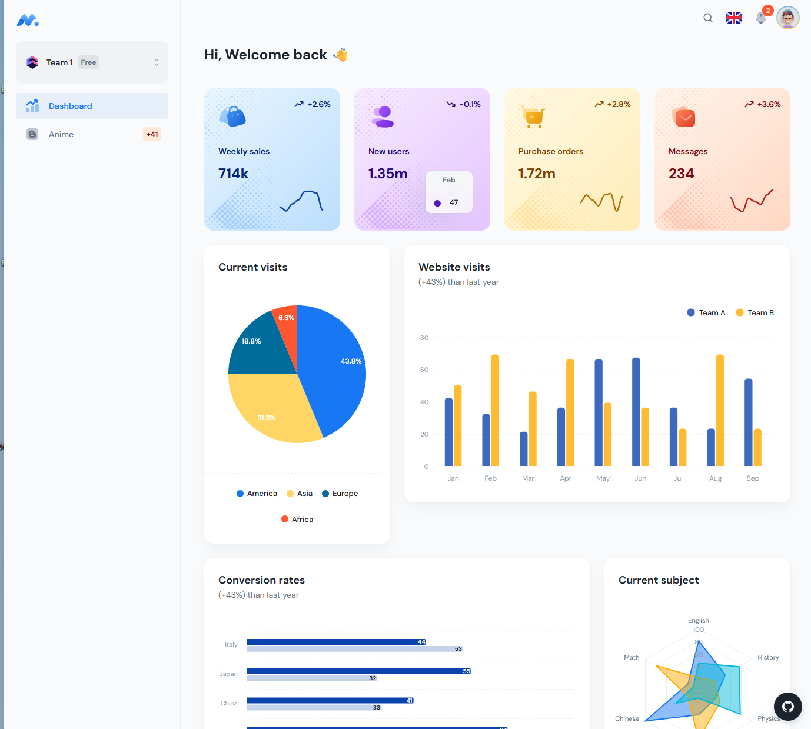
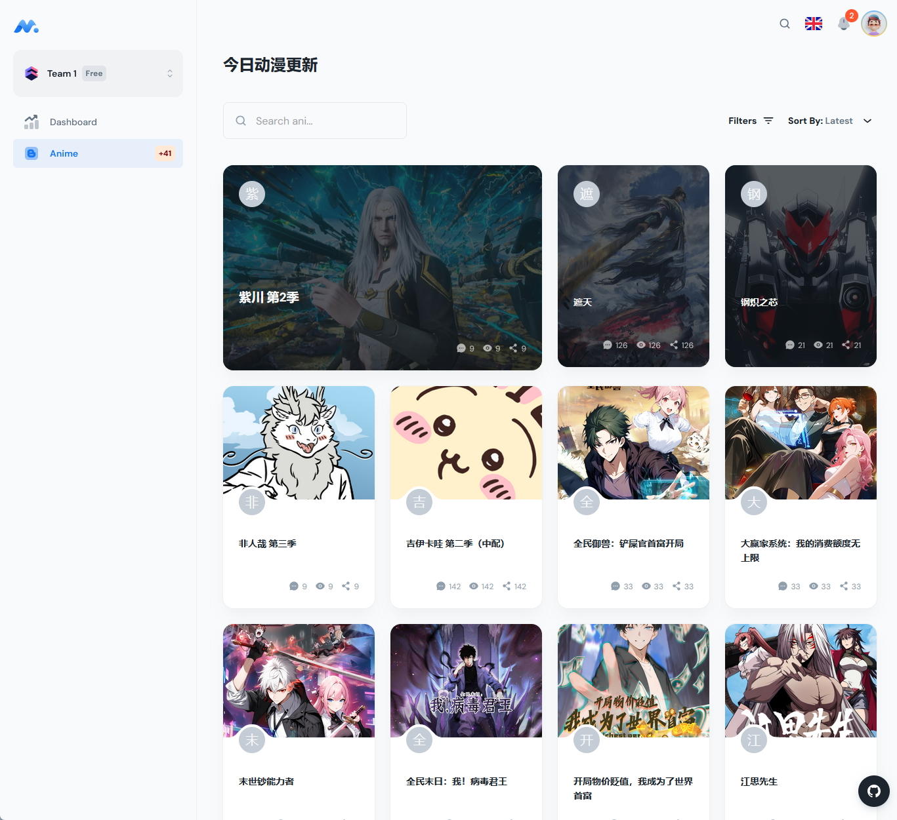

> Free React Admin Dashboard made with Material-UI components and React + Vite.js base on [minimal.free](https://github.com/minimal-ui-kit/minimal.free).

## Quick start

- Clone the repo: `git clone https://github.com/bruceblink/ani-updater-frontend.git`
- Recommended: `Node.js v20.x`
- `cp .env.example .env` and set your environment variables
- **Install:** `npm i` or `yarn install`
- **Start:** `npm run dev` or `yarn dev`
- **Build:** `npm run build` or `yarn build`
- Open browser: `http://localhost:3039`
- the backend's project can use [ani-updater](https://github.com/bruceblink/ani-updater)

## License

Distributed under the [MIT](LICENSE.md) license.

